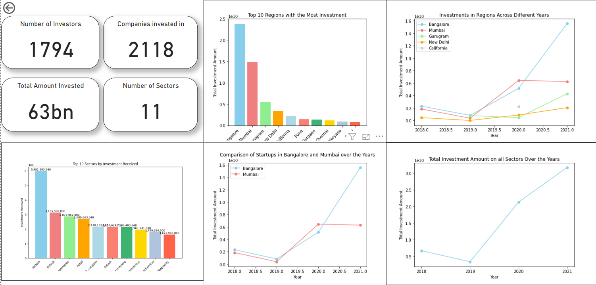

# Indian Startup Ecosystem Dataset

This dataset contains information about the Indian startup ecosystem, including details about investments received by startups across various sectors.

# 💹Startup-Ecosystem

Venturing in the Indian start-up ecosystem, we investigate the ecosystem and propose the best course of action.

## Project Scenario

- Analyze funding received by start-ups in India from 2018 to 2021.
- Separate data for each year of funding will be provided.
- In these datasets, you'll find the start-ups’ details, the funding amounts received, and the investors' information.

## CRISP-DM Framework

We will be using this framework for this project

- Business Understanding
- Data Understanding
- Data Preparation
- Modeling
- Evaluation
- Deployment

## 👨‍💻Dataset Description

- File Name: full_data.csv
- Columns: 10

## 🧹Data Cleaning

The dataset may have undergone some data cleaning and preprocessing for analysis purposes. However, it is advisable to perform further data cleaning and validation based on your specific use case and requirements.
Columns with "Undisclosed" amounts were removed and Amounts in Rupees were also converted to dollars using the mean exchange rate of the year in question.

## 🤷‍♀️Usage

You can use this dataset to analyze the Indian startup ecosystem, explore investment trends across sectors, identify top investors, and gain insights into the funding landscape.

## Power BI screenshot and link

[Power BI Dashboard](https://app.powerbi.com/groups/me/reports/a9e5d660-3e02-4578-a402-09bb8bd8a438/ReportSection?experience=power-bi)

## Examples

Here are some example questions that can be explored using this dataset:

- What are the top sectors by the total amount of investment received?
- Total amount invested over the 4 year period
- Start ups by location
- What Sector had the most funding?

## ⚖️License

MIT license was used, kindly read to know your rights and obligations to utilise this work.

## Acknowledgments

I want to acknowledge the immense contributions of my colleagues
Elias Ongoma
Gloria Givondo
Georgina Njheri
Vanis Kemunto and
Emmanuel Kipngetich, our scrum master.
